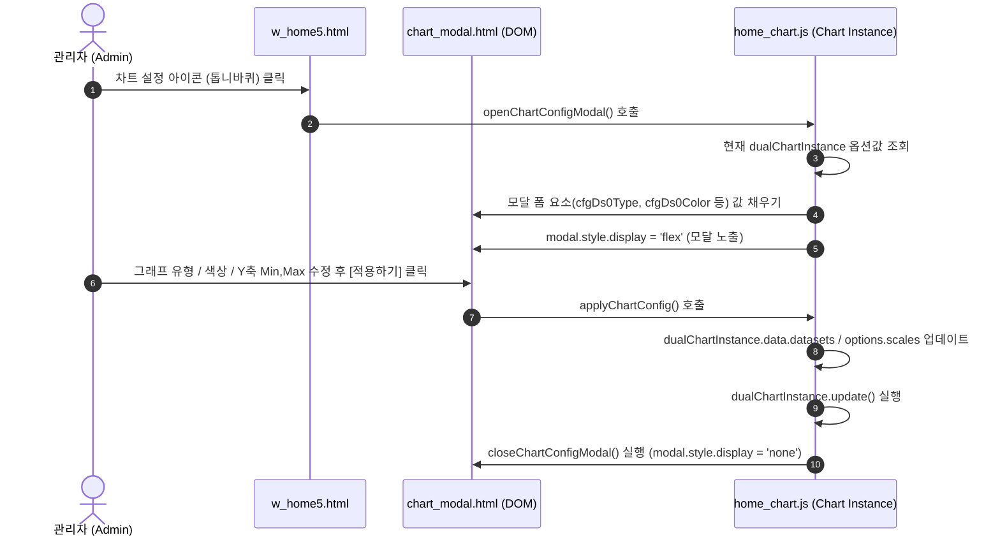

# chart_modal.html (차트 설정 모달 프래그먼트)

## 1. 개요 (Overview)
`chart_modal.html`은 **AAMS 메인 홈 화면(`w_home5.html`)**에서 관리자(Admin) 권한을 가진 사용자가 듀얼 축 차트(순자산 & 계좌수)의 시각적 형태 및 Y축 범위를 동적으로 변경할 수 있도록 제공하는 **Thymeleaf 프래그먼트 팝업 모달 컴포넌트**입니다.

- **파일 위치**: [`src/main/resources/templates/fragments/chart_modal.html`](file:///d:/work/java_full_auto_aams/src/main/resources/templates/fragments/chart_modal.html)
- **프래그먼트명**: `th:fragment="chartConfigModal"`
- **관련 JS 모듈**: [`home_chart.js`](file:///d:/work/java_full_auto_aams/src/main/resources/static/js/home_chart.js)

---

## 2. 주요 기능 및 구성 요소를 위한 HTML 구조

1. **오버레이 레이아웃 (`#chartConfigModal`)**:
   - `class="company-modal-overlay"`를 통해 화면 전체를 딤(Dim) 처리하고 중앙에 모달 창을 띄웁니다.
   - 배경 클릭 시 모달이 닫히도록 `onclick="if(event.target === this) closeChartConfigModal();"` 이벤트 핸들러가 바인딩되어 있습니다.

2. **Left Y1 축 설정 (순자산 데이터셋 0)**:
   - `cfgDs0Type`: 그래프 유형 (꺾은선 Line / 막대 Bar)
   - `cfgDs0Color`: 선 및 막대 색상 (`<input type="color">`)
   - `cfgDs0Dash`: 선 스타일 (점선 Dashed / 실선 Solid)
   - `cfgDs0Width`: 선 두께 (`1px ~ 5px`)
   - `cfgY1Min`, `cfgY1Max`: Left Y1 축의 최소값/최대값 지정 (미입력 시 Auto)

3. **Right Y2 축 설정 (계좌수 데이터셋 1)**:
   - `cfgDs1Type`: 그래프 유형 (막대 Bar / 꺾은선 Line)
   - `cfgDs1Color`: 색상 선택
   - `cfgY2Min`, `cfgY2Max`: Right Y2 축의 최소값/최대값 지정

4. **액션 버튼**:
   - **취소**: `closeChartConfigModal()` 실행 (모달 숨김)
   - **적용하기**: `applyChartConfig()` 실행 (차트 인스턴스 옵션 업데이트 및 재렌더링)

---

## 3. 작동 원리 (Working Principle)

1. **템플릿 조립 시점 (Thymeleaf Rendering)**:
   `w_home5.html` 하단에서 `

` 구문을 만나면, Thymeleaf 엔진이 해당 분리된 모달 HTML을 DOM 트리 하단에 결합합니다.

2. **모달 오픈 시점 (`openChartConfigModal`)**:
   `home_chart.js`에서 글로벌 `dualChartInstance`에 저장된 현재 차트 설정(데이터셋 색상, 라인 두께, 축 스케일 범위)을 추출하여 모달 내 input/select 폼 요소에 역으로 세팅(Population)한 뒤 `display: flex`로 시각화합니다.

3. **차트 동적 적용 시점 (`applyChartConfig`)**:
   사용자가 설정값을 변경하고 [적용하기] 버튼을 누르면, 모달 입력 폼의 값을 수집하여 Chart.js 데이터셋 객체와 스케일(Scale) 설정 객체를 직접 수정하고 `dualChartInstance.update()`를 호출하여 화면 전환 없이 차트를 즉시 재렌더링합니다.
